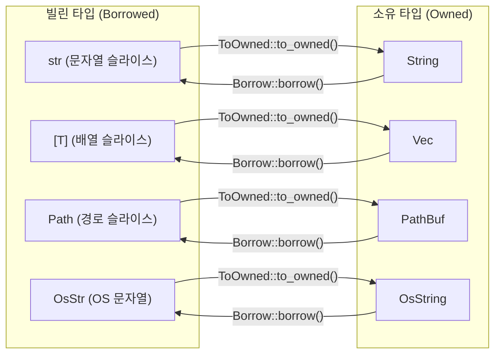

# Cow와 효율적인 데이터 처리

Rust에서 불필요한 메모리 할당을 방지하고 성능을 최적화하는 Cow (Clone-on-Write) 패턴과, 이를 가능하게 하는 핵심 트레이트인 ToOwned와 Borrow에 대해 설명합니다.

## 핵심 개념: `Cow` (Clone on Write)

### Cow란 무엇인가요?
**"수정이 필요할 때만 복사(Clone)하고, 읽기만 할 때는 원본을 빌려(Borrow) 쓴다"** 는 뜻의 스마트 래퍼(Smart Wrapper) 타입입니다.

### 왜 쓰나요?
`String` 같은 힙(Heap) 메모리 할당은 비쌉니다. 데이터가 수정될 확률이 낮다면, 무조건 복사하는 것은 낭비입니다. `Cow`는 이 낭비를 줄여줍니다.

### 구조 (`Enum`)
Cow는 사실 단순한 열거형입니다.

```rust
pub enum Cow<'a, B: ?Sized + 'a>
where
    B: ToOwned,
{
    /// Borrowed data.
    Borrowed(&'a B),

    /// Owned data.
    Owned(<B as ToOwned>::Owned),
}
```

## 작동 원리: 페어 트레이트 (`ToOwned` & `Borrow`)

`Cow`가 `&str`과 `String` 사이를 자유자재로 오갈 수 있는 이유는, 이 두 타입이 서로 **페어(Pair)** 로 묶여 있기 때문입니다. 이 관계를 정의하는 것이 두 트레이트입니다.

### `ToOwned` 트레이트 (참조 -> 소유)

- 역할: 빌린 데이터(참조)를 바탕으로 소유할 수 있는 데이터(값)를 만들어냅니다.
- 방향: `&str` -> `String`
- 의미: `&str`는 잠깐 빌린 건데, 내용을 복사해서 소유할 수 있게 `String`으로 만들어줍니다.

```rust
// 개념적인 코드 (실제 Rust 내부)
trait ToOwned {
    type Owned: Borrow<Self>; // 나의 짝꿍 소유 타입이 무엇인지 정의
    fn to_owned(&self) -> Self::Owned; // 나를 복제해서 짝꿍을 만들어주는 함수
}

// str에 구현된 모습
impl ToOwned for str {
    type Owned = String; // str의 소유 짝꿍은 String이야!
    fn to_owned(&self) -> String {
        // ...여기서 실제로 String을 생성하고 내용을 복사함...
    }
}

/// Basic usage:
let s: &str = "a";
let ss: String = s.to_owned();

let v: &[i32] = &[1, 2];
let vv: Vec<i32> = v.to_owned();
```

>"왜 `Clone` 트레이트는 안 쓰나요?"
Clone은 보통 같은 타입으로 복사할 때 씁니다. (`String` ➔ `String`) 하지만 우리는 다른 타입으로 복사해야 합니다. (`&str` ➔ `String`)

### `Borrow` 트레이트 (소유 -> 참조)

- 역할: 소유한 데이터를 마치 빌린 데이터인 것처럼 사용할 수 있도록 합니다.
- 방향: `String` -> `&str`
- 의미: 힙에 있는 `String`으로 `&str` 기능을 사용할 수 있게 빌려줍니다.

```rust
// String에 구현된 모습
impl Borrow<str> for String {
    fn borrow(&self) -> &str {
        &self[..] // String 전체를 &str 슬라이스로 빌려줌
    }
}
```

### Rust 주요 타입들의 관계도

